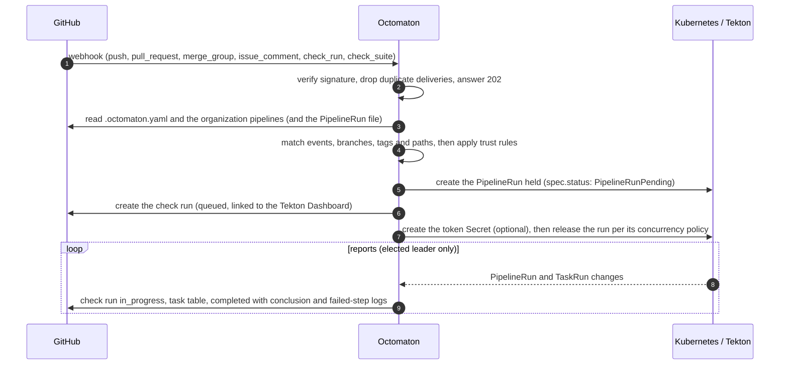

# Octomaton

Octomaton replaces GitHub Actions for the `arikkfir-org` organization. A GitHub App sends every webhook to
Octomaton (running in GKE); Octomaton reads the repository's root `.octomaton.yaml` and the organization pipelines its
owner declares in its organization repository, creates the Tekton `PipelineRun`s it maps the event to, and reports each
run back to GitHub as a check run.

Octomaton is **application-agnostic**: it knows nothing about what a repository builds, its language or layout. The
only repository files it reads are `.octomaton.yaml` (the repository's own, and the one in its owner's organization
repository, which a server setting names) and the PipelineRun files they point to. PipelineRun files are plain Tekton
YAML; Octomaton injects event context only through `params` and an optional GitHub token workspace.

## How it works



1. Every webhook is verified (HMAC-SHA256) before anything else, then processed asynchronously on a bounded worker
   pool. A full queue answers 503, so GitHub records a failed delivery that can be redelivered.
2. The event is matched against each pipeline's triggers. A matching pipeline whose path filters do not match gets a
   check run concluded `skipped` (required checks do not block). Forks are ignored outright: see [Security](#security).
3. Runs are named `<repo>-<pipeline>-<sha7>-<attempt>`. A redelivery, or a second event for the same commit, pipeline and
   branch, finds the existing run. Each comment command and review request gets its own run, new commits on a pull
   request run every review request still pending on it again, and re-runs create the next attempt.
4. Runs are created held, then their check run and token Secret are created, then they are released per their
   concurrency group. If anything fails in between, the run is cancelled and its check says why. A run held longer than
   five minutes is resumed by the leader (which also serves as the poll for queued runs).
5. The elected leader watches the runs and keeps their checks up to date, refreshes GitHub tokens of long runs, fires
   cron schedules and deletes PVCs of finished runs.
6. Every GitHub request is retried when it fails for a reason that may pass (a connection error or timeout, a 5xx but
   501, a 429, a secondary rate limit): up to 6 attempts, waits doubling from 1 s to 30 s or as `Retry-After` says, each
   retry logged as a warning (a `Retry-After` is followed up to a minute). An event whose requests still fail is
   reported, retried the same way and past the webhook job's deadline: a configuration that could not be read fails
   `octomaton` (the scheduled pipeline's check when a schedule fires; a reply when a comment command is declined), and a
   run whose check could not be opened fails its pipeline's check. Re-running a failed check tries again, and concludes
   `octomaton` successfully when the event evaluates. Only the periodic read of schedules just logs; a failure report
   that still fails is logged as an error ([design](https://github.com/arikkfir-org/docs/blob/main/hub/designs/octomaton-github-retries.md)).

## Repository configuration (`.octomaton.yaml`)

The only file Octomaton reads from a repository, always at the root. It is parsed as YAML 1.2, so the `on` key needs
no quoting, and strictly: unknown fields, duplicate keys and type mismatches are errors. The organization repository's
copy may also declare organization pipelines, which every repository of the owner runs (below).

```yaml
apiVersion: octomaton.dev/v1
pipelines:
  - name: ci                           # identifies the pipeline and its runs; unique; [a-z0-9][a-z0-9-]*
    displayName: Continuous Integration  # optional: the check's name on GitHub (default: name); unique
    pipelineRun: .tekton/ci.yaml       # repository-relative file holding exactly one tekton.dev/v1 PipelineRun
    # pipelineRun:                     # or a file in another repository of the same owner, read at its default branch
    #   repository: tooling
    #   path: reviewer/pipelinerun.yaml
    on:
      pull_request:
        branches: [main]               # base-branch globs; omitted = all
        types: [opened, reopened, synchronize, ready_for_review]  # default
        drafts: true                   # default; false skips draft pull requests
        paths: ["**"]                  # optional globs; no match = check reported as skipped
        pathsIgnore: []                # optional
      merge_group:                     # merge queue; optional base-branch globs
        branches: [main]
      push:
        branches: [main]               # branch globs
        tags: ["v*"]                   # tag globs
        paths: []                      # optional
      comment:                         # pull request comment command, e.g. "/deploy staging"
        pattern: "^/deploy\\b"         # regexp on the comment's first line; commenter needs write access
        branches: [main]               # optional pull request base-branch globs
      review_request:                  # a review is requested from one of these users on a pull request
        reviewers: [arikkfir-reviewer] # GitHub logins, case-insensitive; required
        branches: [main]               # optional pull request base-branch globs
      schedule:                        # cron, 5 fields, UTC; runs at the default branch head
        - cron: "0 3 * * *"
    params:                            # set/override PipelineRun spec.params; values are Go templates
      repo-url: "{{ .Repository.CloneURL }}"
      revision: "{{ .Revision }}"
    githubToken:                       # optional installation token for this repository, refreshed while the run lives
      workspace: github-token          # bound as a Secret workspace (key: token)
      permissions: {contents: read}    # default
      # repositories: all              # optional: every repository the App is installed on in the owner, not just this
                                       # one; only when every trigger reads definitions from the default branch
    secrets: []                        # optional: Secrets in the run's namespace it may mount; only when every
                                       # trigger reads definitions from the default branch (comment, review_request,
                                       # schedule)
    timeout: 1h                        # optional, sets spec.timeouts.pipeline
    concurrency:                       # optional; default for pull_request and review_request:
                                       # group "pr-<number>", policy supersede
      group: "publish"                 # Go template, scoped to the repository
      policy: latest                   # supersede | queue | latest
    taskChecks: false                  # optional: also report each pipeline task as "<check> / <task>"
organization:                          # only in the organization repository: pipelines for every repository
  pipelines: []                        # same fields as pipelines; read at its default branch
```

### Triggers

| Trigger | Matches | Notes |
| --- | --- | --- |
| `pull_request` | the listed actions (`types`) on pull requests whose base branch matches `branches` | Default types: `opened`, `reopened`, `synchronize`, `ready_for_review`. `drafts: false` skips draft pull requests. |
| `merge_group` | `checks_requested` for merge groups whose base branch matches `branches` | Also accepts `paths`/`pathsIgnore`. A destroyed merge group cancels its runs. |
| `push` | pushes of branches matching `branches` and tags matching `tags` | As in GitHub Actions: with neither set every push matches; with only `branches`, tag pushes are ignored; with only `tags`, branch pushes are ignored. Deleted refs and merge queue branches never match. |
| `comment` | a pull request comment whose first line matches `pattern` (which must start with `^/`) | Only new comments on open, non-draft pull requests into `branches`, by users with write access. |
| `review_request` | a review requested from one of `reviewers` (logins, case-insensitive) on an open pull request into `branches` | Drafts included; team requests are ignored. Requesting a review takes triage or write access. New commits (`synchronize`) while the review is still requested run it again at the new head and supersede the older commit's run: GitHub sends no new request while one is pending. `review_requested` is not a `pull_request` type. An invalid configuration is not reported on review requests: most are for people; one GitHub would not serve is. |
| `schedule` | each `cron` slot (5 fields, UTC) | Runs at the head of the default branch, once per slot, up to 10 minutes late. |

Globs use [doublestar](https://github.com/bmatcuk/doublestar) syntax: `*` stays within a path segment, `**` crosses
segments. **Path filters** (`paths`, `pathsIgnore`) apply to the files the event changes (pull request files; the
comparison `before...after` for pushes; `base...head` for merge groups). A file is relevant when it matches `paths`
(when set) and does not match `pathsIgnore`. With no relevant file the pipeline's check is concluded `skipped`. When the
changed files cannot be determined (a new branch or tag, an API error, more files than GitHub lists), the filters are
ignored and the pipeline runs.

**Where definitions are read:** pull requests, merge groups and pushes read `.octomaton.yaml` and the PipelineRun file
at the commit under test. Comment commands, review requests and schedules read them from the default branch (comment
commands and review requests still run against the pull request's head commit, so a pull request cannot change what
they run). A `pipelineRun` in another repository is always read at that repository's default branch.

**Organization pipelines:** the organization repository, which `OCTOMATON_ORGANIZATION_REPOSITORY` names (`tooling` in
the hub), may declare `organization.pipelines` in each owner, with the same fields as `pipelines`. Octomaton adds them
to the pipelines of every repository of that owner, the organization repository included, and always reads them at the
organization repository's default branch, even for its own pull requests. A plain `pipelineRun` path in them names a
file of the organization repository. Their runs belong to the repository: its namespace, checks, template context and
token. A repository pipeline with the name or check name of an organization pipeline is a configuration error of that
repository, so no repository can replace one. Organization pipelines can't use `schedule`, and `secrets` follows the
same rule as for any pipeline. `organization` in any other repository, or when the setting is unset, is a
configuration error. Without the setting, the file or the section, there are no organization pipelines. A repository
without its own `.octomaton.yaml` still runs them, and an unreadable or invalid organization repository configuration
stops every pipeline of the repository, reported on the `octomaton` check.

### Pipeline settings

| Field | Meaning |
| --- | --- |
| `name` | Identifies the pipeline: in run names, labels, concurrency groups and `{{ .Pipeline }}`. Unique, organization pipelines included; `[a-z0-9][a-z0-9-]*`, at most 63 characters. `octomaton` is reserved. |
| `displayName` | The name of the pipeline's check on GitHub, which required checks match (for example `Continuous Integration`); `name` when omitted. At most 100 characters, no control characters or surrounding spaces; unique among the pipelines' check names, organization pipelines included; `octomaton` is reserved. |
| `pipelineRun` | Repository-relative path of a file holding exactly one `tekton.dev/v1` `PipelineRun`, or `{repository, path}` for a file in another repository of the same owner (read at its default branch; the App must be installed there). Its `metadata.name`/`generateName` are replaced; a `metadata.namespace` other than the repository's namespace is refused. The PipelineRun must be self-contained: remote references are refused (see [Security](#security)). |
| `params` | Sets `spec.params` entries by name (existing entries are overridden, new ones appended). Values are Go `text/template`s over the context below; a missing value fails the check with the rendering error. |
| `githubToken` | Mints an installation token restricted to this repository with `permissions` (default `contents: read`), stores it in Secret `<run>-github-token` (key `token`, owned by the run) and binds it to `workspace`. The token is refreshed while the run lives; read it from the file each time you need it. `repositories: all` mints it for every repository the App is installed on in the owner instead, with the same `permissions`; only a pipeline whose every trigger is `comment`, `review_request` or `schedule` may ask for it, as for `secrets`. |
| `secrets` | Names of Secrets in the run's namespace that its runs may mount, besides the token. Only a pipeline whose every trigger is `comment`, `review_request` or `schedule` may list any, because only those read definitions from the default branch. |
| `timeout` | Go duration, sets `spec.timeouts.pipeline`. |
| `concurrency` | Limits runs sharing a group (below). |
| `taskChecks` | Also reports every task of the PipelineRun's own `spec.pipelineSpec` as a check named `<check> / <task>`, where `<check>` is the pipeline's check name. |

**Concurrency.** Groups are rendered from the `group` template and scoped to the repository, so two pipelines naming
the same group share it (include `{{ .Pipeline }}` to keep them apart).

| Policy | Behaviour |
| --- | --- |
| `supersede` | The newest commit wins: older live runs in the group are cancelled and their checks concluded `skipped` ("Superseded"). A run whose commit is no longer the head of its branch or pull request stands itself down. |
| `queue` (default) | One run at a time, oldest first. |
| `latest` | One run at a time; only the newest waiting run survives, older waiting runs are cancelled. |

Without `concurrency`, pull request and review request runs of the same pipeline and pull request share the group
`pr-<number>` (per pipeline) with policy `supersede`; other runs are unconstrained.

### Template context

`.Event` (`push`, `pull_request`, `merge_group`, `comment`, `review_request`, `schedule`), `.Action`, `.Repository`
(`Owner`, `Name`, `FullName`, `CloneURL`, `HTMLURL`, `DefaultBranch`, `Private`), `.Revision` (SHA under test), `.Ref`,
`.Branch`, `.Tag`, `.Sender`, `.Pipeline`, `.Push` (`Before`, `After`), `.PullRequest` (`Number`, `HeadRef`, `HeadSHA`,
`BaseRef`, `BaseSHA`), `.MergeGroup` (`HeadRef`, `HeadSHA`, `BaseRef`, `BaseSHA`), `.Comment` (`ID`, `Author`,
`Command`, `Arguments`), `.ReviewRequest` (`Reviewer`), `.Schedule` (`Cron`, `Slot`). Event-specific objects are nil for
other events; referencing a missing value fails the check with the rendering error. Guard optional objects with
`{{ if .PullRequest }}…{{ end }}`.

| Event | `.Revision` | `.Ref` | `.Branch` | Objects set |
| --- | --- | --- | --- | --- |
| `push` | pushed commit (the tagged commit for annotated tags) | `refs/heads/<b>` or `refs/tags/<t>` | pushed branch (`.Tag` for tags) | `.Push` |
| `pull_request` | head commit | `refs/pull/<n>/head` | head branch | `.PullRequest` |
| `merge_group` | merge group head | merge group ref | merge group branch | `.MergeGroup` (`HeadRef`/`BaseRef` are full refs) |
| `comment` | pull request head commit | `refs/pull/<n>/head` | head branch | `.PullRequest`, `.Comment` (`Command` is the first word, `Arguments` the rest of the first line) |
| `review_request` | pull request head commit | `refs/pull/<n>/head` | head branch | `.PullRequest`, `.ReviewRequest` (`Reviewer` as GitHub sent it; `.Action` is `review_requested`) |
| `schedule` | head of the default branch | `refs/heads/<default>` | default branch | `.Schedule` (`Slot` is RFC 3339, UTC) |

Values such as `.Comment.Arguments`, branch names and `.Sender` come from users: pass params to scripts through
environment variables, never by interpolating `$(params.…)` into a script.

### Examples

```yaml
apiVersion: octomaton.dev/v1
pipelines:
  - name: ci                                 # required check on pull requests and in the merge queue
    pipelineRun: .tekton/ci.yaml
    on:
      pull_request: {branches: [main], pathsIgnore: ["docs/**", "**/*.md"]}
      merge_group: {}
    params:
      repo-url: "{{ .Repository.CloneURL }}"
      revision: "{{ .Revision }}"
  - name: publish                            # one publication at a time, only the newest waiting one
    pipelineRun: .tekton/publish.yaml
    on:
      push: {branches: [main]}
    params:
      revision: "{{ .Revision }}"
    githubToken: {workspace: github-token, permissions: {contents: read}}
    concurrency: {group: "publish", policy: latest}
  - name: deploy                             # "/deploy staging" on a pull request into main
    pipelineRun: .tekton/deploy.yaml
    on:
      comment: {pattern: "^/deploy\\b", branches: [main]}
    params:
      revision: "{{ .Revision }}"
      environment: "{{ .Comment.Arguments }}"
  - name: nightly
    pipelineRun: .tekton/nightly.yaml
    on:
      schedule: [{cron: "0 3 * * *"}]
    params:
      slot: "{{ .Schedule.Slot }}"
  - name: review                             # a review requested from review-bot, run from another repository
    pipelineRun: {repository: shared-pipelines, path: review/pipelinerun.yaml}
    on:
      review_request: {reviewers: [review-bot]}
    params:
      number: "{{ .PullRequest.Number }}"
      revision: "{{ .Revision }}"
    secrets: [model-api-key]                 # every trigger reads the default branch, so it may mount a Secret
```

In the organization repository (`OCTOMATON_ORGANIZATION_REPOSITORY`), a pipeline every repository runs:

```yaml
apiVersion: octomaton.dev/v1
pipelines: []
organization:
  pipelines:
    - name: review                           # a review requested from review-bot, in any repository
      pipelineRun: {repository: shared-pipelines, path: review/pipelinerun.yaml}
      on:
        review_request: {reviewers: [review-bot]}
      params:
        repository: "{{ .Repository.FullName }}"
        number: "{{ .PullRequest.Number }}"
      secrets: [model-api-key]               # a Secret of the same name in each repository's namespace
```

Validate a configuration and the PipelineRun files it references with `octomaton-lint [-render] PATH...` (PATH is
the file or its directory); it renders every param for every triggering event with placeholder values, so a template
that only works for one event is reported. Exit code 0 means clean, 1 problems, 2 usage.

## Check runs

- Each run reports on a check named after its pipeline (its `displayName`, or else its `name`): `queued` →
  `in_progress` → `completed`, linked to `https://tekton.dev.kfirs.com/#/namespaces/<namespace>/pipelineruns/<name>`,
  with `external_id` `<namespace>/<name>`.
- While a run of two or more tasks runs, the title reads `<done> of <n> · <running task> · <elapsed>` and the summary
  holds a task table (✅ ❌ ⏳ ⬜); it is rewritten only when the table changes.
- Conclusions: `Succeeded=True` → `success`; superseded → `skipped` ("Superseded"); cancelled or stopped → `cancelled`;
  `PipelineRunTimeout` → `timed_out`; any other failure → `failure`, with the last 50 lines of each failed step's log.
- Nothing from a run reaches GitHub with its secrets: failed steps' logs, `check-title`/`check-summary` and task
  failure messages lose every value of every Secret the PipelineRun references (its token Secret included), raw or
  base64-encoded, alone or inside a longer value, and anything shaped like a well-known credential (GitHub tokens,
  private keys, Google keys and tokens, `sk-` API keys, JWTs, AWS and Slack keys, `Authorization` headers, passwords
  in URLs). Values shorter than 8 characters are left to those patterns. When a Secret can't be read, the logs,
  results and task messages are withheld, and the check still concludes. A credential a step fetches itself in another
  format, or prints transformed (split, encrypted, partly), is not caught: never print secrets.
- A pipeline or task result named `check-title` or `check-summary` replaces the check's title or Markdown summary.
- Problems that prevent a run (an invalid `.octomaton.yaml`, a missing namespace or file, a template error, a
  refused Secret) are reported as failed checks: `octomaton` for configuration errors, the pipeline's check otherwise.
- Every check stores its trigger context in a hidden marker in its output, so **Re-run** works even after the
  PipelineRun was pruned. Re-running a pipeline's check always runs it (path filters are not re-applied; the requester
  needs write access); re-running `octomaton` re-evaluates the whole event.
- Comment commands get a 👀 reaction when started, a 👎 and a reply when declined, and a reply with the result when done.

## Security

- Only webhooks with a valid signature are processed; only installations on `OCTOMATON_GITHUB_ALLOWED_OWNERS` are
  served.
- Octomaton never acts on forks. It ignores every event from a repository that is itself a fork, and every pull
  request whose head branch lives in another repository (or in one that no longer exists), whoever opened it: no check
  run, no run, no reaction or reply to comment commands on it, and no re-run of reports stored for it. Pull requests
  from the repository's own branches run automatically: pushing a branch there takes write access.
- A run may mount no Secret other than the token Octomaton binds and those its pipeline lists in `secrets` (volumes,
  workspaces, projected sources, `env` and `envFrom` are checked). Only a pipeline whose every trigger reads its
  definitions from the default branch may list any, so definitions at a pull request's head never reach a listed
  Secret. Tokens are scoped to the event's repository with least permissions, unless the pipeline asks for every
  repository (`githubToken.repositories: all`), which follows the same rule as `secrets`.
- Remote Tekton references are refused (`pipelineRef`, `taskRef`, a step's `ref`, any `resolver` or `bundle`), because
  Octomaton can only check the definitions it can see: a PipelineRun holds its whole `spec.pipelineSpec`, with a
  `taskSpec` per task.
- A review request is only as trusted as whoever requested it: that takes triage or write access, and the pull request
  must come from the repository's own branches. Only new commits on such a branch, which take write access, run a
  pending request again.
- Organization pipelines are read at the organization repository's default branch, so no pull request, not even one on
  that repository, changes what they run, and no repository can replace one with a pipeline of the same name or check
  name. Their runs get the repository's namespace and token, like its own.
- A ServiceAccount in a tenant namespace may carry the annotation `octomaton.dev/branches`: comma-separated branch
  globs, as in `on.push.branches`. A run that names it (`spec.taskRunTemplate.serviceAccountName` or
  `spec.taskRunSpecs[].serviceAccountName`) is refused unless its branch matches one. The run's branch is the branch
  whose code runs: the pushed branch, a pull request's head branch (also for comment commands and review requests),
  the merge group's branch, or the default branch for schedules; a tag push has none and matches nothing. Without the
  annotation, every branch may use the ServiceAccount; an empty or invalid one lets none. The check fails closed: a
  named ServiceAccount Octomaton can't read (other than one that doesn't exist, which Tekton fails) refuses the run
  too. A run that names no ServiceAccount runs as Tekton's default, which is never checked. This is the one setting
  outside `.octomaton.yaml`: it sits on the identity, where the repository can't change it.
- Namespaces, not pipelines, are the isolation boundary: pull requests can change their own pipeline files and thereby
  use their namespace's service accounts, except those restricted to other branches.

## Server configuration

The server takes no arguments: environment variables configure it, and it exits at startup listing every problem.

| Variable | Default | Meaning |
| --- | --- | --- |
| `OCTOMATON_GITHUB_APP_ID` | required | the GitHub App's ID |
| `OCTOMATON_GITHUB_PRIVATE_KEY` | required | the App's PEM private key (PKCS#1 or PKCS#8) |
| `OCTOMATON_GITHUB_WEBHOOK_SECRET` | required | the App's webhook secret |
| `OCTOMATON_GITHUB_ALLOWED_OWNERS` | every owner | users and organizations whose installations are served, comma-separated |
| `OCTOMATON_TEKTON_DASHBOARD_URL` | none | Tekton Dashboard base URL that check runs link to |
| `OCTOMATON_NAMESPACE_TEMPLATE` | `ci-{{ .Repository.Name }}` | namespace of a repository's runs, rendered then sanitized |
| `OCTOMATON_NAMESPACE_OVERRIDES` | none | `owner/name:namespace` pairs, comma-separated; they win over the template |
| `OCTOMATON_ORGANIZATION_REPOSITORY` | none | the repository, in each owner, whose `.octomaton.yaml` may declare organization pipelines; none disables them |
| `OCTOMATON_RELAY_URLS` | none | URLs that receive verified `push` and `ping` deliveries, comma-separated |
| `OCTOMATON_RETENTION_FREE_PVCS_AFTER` | `1h` | delay after which the PVCs of finished runs are deleted; runs and pods stay |
| `OCTOMATON_HTTP_ADDRESS` | `:8080` | address of `/github/hooks`, `/healthz` and `/readyz` |
| `OCTOMATON_WEBHOOK_WORKERS`, `OCTOMATON_WEBHOOK_QUEUE_SIZE` | `8`, `256` | webhook worker pool |
| `OCTOMATON_POD_NAME`, `OCTOMATON_POD_NAMESPACE` | host name, service account namespace | holder identity and namespace of the Lease `octomaton` |
| `OCTOMATON_LOG_LEVEL` | `info` | `debug`, `info`, `warn` or `error` |
| `OTEL_SERVICE_NAME`, `OTEL_RESOURCE_ATTRIBUTES` | `octomaton` | added to the resource of exported metrics and traces, e.g. `k8s.pod.name=…` |
| `KUBECONFIG` | in-cluster config | used when not running in a cluster |

- `OCTOMATON_NAMESPACE_TEMPLATE` is rendered over `.Repository`, then sanitized: lowercased, leading dots stripped,
  every run of characters outside `[a-z0-9-]` replaced by `-`, leading and trailing `-` trimmed, cut to 63 characters.
  Overrides (`owner/name`, case-insensitive) win. A namespace that does not exist fails the check with "repository not
  onboarded".
- `OCTOMATON_RELAY_URLS` receive the original body and GitHub headers (signatures included), asynchronously, with a
  10 s timeout.

Telemetry follows where the server runs. On GKE (a Kubernetes pod with a GCP metadata server), logs are JSON on stdout
with the fields Cloud Logging reads, including the links to traces, and metrics and traces go to Cloud Monitoring and
Cloud Trace through the Telemetry API (`telemetry.googleapis.com`). They are sent as the pod's Kubernetes
ServiceAccount, which needs `roles/telemetry.metricsWriter`, `roles/telemetry.tracesWriter` and
`roles/serviceusage.serviceUsageConsumer` (the project is the quota project). Anywhere else, logs are text and nothing
is exported.

## GitHub App

`octomaton-dev` (`Octomaton` is taken on GitHub), installed on all `arikkfir-org` repositories, homepage
`https://github.com/arikkfir-org/octomaton`, webhook URL `https://octomaton.dev/github/hooks`. Octomaton identifies the
App by its ID, never by its name.

- Repository permissions: Checks: read and write; Contents: read; Metadata: read; Pull requests: read and write; Merge
  queues: read.
- Events: `push`, `pull_request`, `issue_comment`, `check_suite`, `check_run`, `merge_group`.

## Deployment

The hub runs Octomaton from [`deploy/`](deploy/) (Kustomize), the hub's deployment as written: the Argo CD Application
`octomaton` in [`arikkfir-org/delivery`](https://github.com/arikkfir-org/delivery) syncs it from `main`, in its
AppProject `octomaton`, and overrides what `delivery` decides: it tags the image with the synced commit's short SHA, so
every merge to `main` rolls out once `release` has published that image, and labels the namespace
`kfirs.com/public-ingress`, which admits the webhook's route to the public gateway. `make manifests` (and CI) renders
`deploy/` both ways and validates it. Namespace `octomaton` (the restricted Pod Security Standard enforced),
Deployment/ServiceAccount/Service `octomaton` (Service port 80 → container 8080), ConfigMap `octomaton`
(the non-secret variables, through `envFrom`), Secret `octomaton-github` (keys `app-id`, `private-key` and
`webhook-secret`, as `OCTOMATON_GITHUB_APP_ID`, `OCTOMATON_GITHUB_PRIVATE_KEY` and `OCTOMATON_GITHUB_WEBHOOK_SECRET`).
Every replica serves webhooks; the replica holding the Lease `octomaton` in its namespace reports runs, fires schedules,
refreshes tokens and deletes PVCs of finished runs. The hub runs two replicas of `octomaton` and of `go-import`, spread
over nodes when there are several, each with a PodDisruptionBudget of `maxUnavailable: 1`, so a node drain never takes
both.

Endpoints (all on 8080): `POST /github/hooks`; `GET /healthz` (process up); `GET /readyz` (Kubernetes API reachable and, on
the leader, the PipelineRun informer synced).

**RBAC Octomaton needs:**

| Scope | Permissions |
| --- | --- |
| Tenant namespaces (`ClusterRole octomaton-tenant`, RoleBinding `octomaton` in each `ci-<repository>`) | PipelineRuns: create, get, list, watch, patch, update, delete; TaskRuns: get, list, watch; Secrets: create, get, patch, update, delete; Pods: get, list; `pods/log`: get; PersistentVolumeClaims: get, list, delete; ServiceAccounts: get |
| Cluster | PipelineRuns: get, list, watch (the leader's watch, token refresh and retention); Namespaces: get (optional; without it a missing namespace surfaces as the creation error) |
| `octomaton` namespace | Leases: get, create, update |

**Metrics** (in Cloud Monitoring under `prometheus.googleapis.com/`): counters `octomaton.webhooks.received{event}`,
`octomaton.webhooks.rejected{event,reason}`, `octomaton.runs.created{result}` (`created`, `existing`, `skipped`,
`failed`, `error`) and `octomaton.github.checkrun.errors{operation}`; histogram
`octomaton.reconcile.duration{result}` (seconds); gauges `octomaton.webhook.queue.depth` and `octomaton.leader`; and
OpenTelemetry's HTTP server metrics for `/github/hooks` (`http.server.request.duration`, …). **Traces:** a span per
webhook request.

**Bookkeeping:** objects Octomaton creates carry the label `app.kubernetes.io/managed-by: octomaton` and labels and
annotations under `octomaton.dev/` (`pipeline`, `event`, `repository-id`, `sha`, `concurrency-group`, `done`,
`repository`, `check-run-id`, `installation-id`, `delivery-id`, `context`, `reported`, …). They are never read as
configuration.

## Development

The module path is `octomaton.dev`: `https://octomaton.dev` answers `go get` with a `go-import` tag pointing at this
repository, so the linter installs with:

```bash
go install octomaton.dev/cmd/octomaton-lint@latest
```

Requirements: Go 1.27. `make image` runs [ko](https://ko.build) v0.19.1 through `go run`, as the release pipeline does.

```bash
make test      # go vet ./... && go test -race ./...
make lint      # octomaton-lint . (this repository's own .octomaton.yaml)
make manifests # deploy/ as written and as delivery's main deploys it, validated (Docker)
make build     # bin/octomaton and bin/octomaton-lint
```

Run locally against a cluster (the current `KUBECONFIG` context):

```bash
export OCTOMATON_GITHUB_APP_ID=123456 OCTOMATON_GITHUB_PRIVATE_KEY="$(cat app.pem)" OCTOMATON_GITHUB_WEBHOOK_SECRET=…
go run ./cmd/octomaton
```

### Architecture

The code has three layers, wired together by `cmd/octomaton`; dependencies point inward
([design](https://github.com/arikkfir-org/docs/blob/main/hub/designs/octomaton-architecture.md)):

- **Services** (`internal/services`) hold the CI logic, in Octomaton's own terms. `ci` defines the vocabulary
  (repository, trigger, event, run, report) and the ports the other layers implement: `CodeHost` (GitHub) and `Runner`
  (Tekton).
- **Adapters** (`internal/adapters`) implement the ports over GitHub, Tekton, Kubernetes and HTTP.
- **System** (`internal/system`) configures the process: configuration, telemetry, metrics, the version.

| Package | Role |
| --- | --- |
| `cmd/octomaton` | The server: signals, telemetry, configuration, wiring, shutdown |
| `cmd/octomaton-lint` | The linter's launcher |
| `internal/services/ci` | Vocabulary and ports; standard library only (`citest`: in-memory `CodeHost` and `Runner`) |
| `internal/services/pipelines` | `.octomaton.yaml`: schema, event matching, templates |
| `internal/services/runs` | Events to runs: evaluation, trust, path filters, start, concurrency, re-runs, comment commands |
| `internal/services/reports` | Runs to reports: progress, task tables, conclusions, failure logs, task checks |
| `internal/services/schedules` | Cron triggers to runs |
| `internal/services/upkeep` | Token refresh; freeing finished runs' resources |
| `internal/services/lint` | Validating a repository's configuration as Octomaton would run it |
| `internal/adapters/github` | `CodeHost`: App authentication, REST calls, check runs and their trigger marker, webhook payloads to events (`githubtest`: fake GitHub API) |
| `internal/adapters/tekton` | `Runner`: PipelineRun rendering, bookkeeping labels and annotations, status to runs, the watch |
| `internal/adapters/http` | HTTP server, readiness, the webhook endpoint (signature, deduplication, worker pool) |
| `internal/adapters/kube`, `leader`, `relay` | Kubernetes clients, Lease election, forwarding deliveries |
| `internal/system/config`, `telemetry`, `metrics`, `buildinfo` | Environment configuration, logs and OpenTelemetry, metric recorders, version |

Services are tested against the in-memory `citest` fakes. Adapters are tested against the fake GitHub API and
client-go's fake clients. `internal/e2e` drives signed webhooks through the real adapters and services. The layering
itself is tested by `internal/architecture`, which fails on any import that points outward.

## Releases

Every commit on `main` is a release, named by its short SHA; there are no version tags. Octomaton builds itself:
`.octomaton.yaml` runs `ci` (lint, `deploy/` rendered and validated, vet, race tests, build) on pull requests and in
the merge queue, and `release` on pushes to `main`. `release` publishes the image to
`me-west1-docker.pkg.dev/arikkfir/images/octomaton`, tagged with the commit's short SHA (for example `afa6953`) and
`main`. The same short SHA is the version the binary reports and the `service.version` of its telemetry. Argo CD runs
the image of the newest commit on `main` ([Deployment](#deployment)).

This repository also publishes the hub's pull request reviewer image, `images/reviewer` (opencode plus the tools the
model runs; `arikkfir-org/tooling` runs it). `reviewer-image-check` builds it on pull requests that change it, and
`reviewer-image` publishes it from `main` when it changes, with rootless BuildKit, to
`me-west1-docker.pkg.dev/arikkfir/images/reviewer`, tagged with the commit's short SHA and `main`. `tooling` runs its
`main` tag, so a merge that changes it reaches the next review. Octomaton itself never reads it.

The first image has to come from a workstation, before Octomaton runs, and from the head of `main`: that is the
commit Argo CD deploys. `make image` builds and pushes the image of `HEAD` the way the release pipeline would, except
for the `main` tag, and refuses uncommitted changes:

```bash
gcloud auth configure-docker me-west1-docker.pkg.dev
git clone https://github.com/arikkfir-org/octomaton && cd octomaton
make image
```
